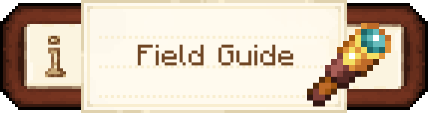
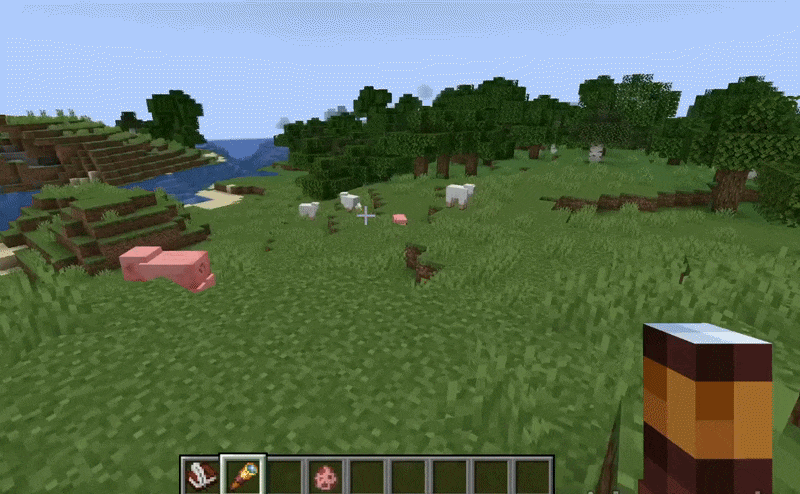
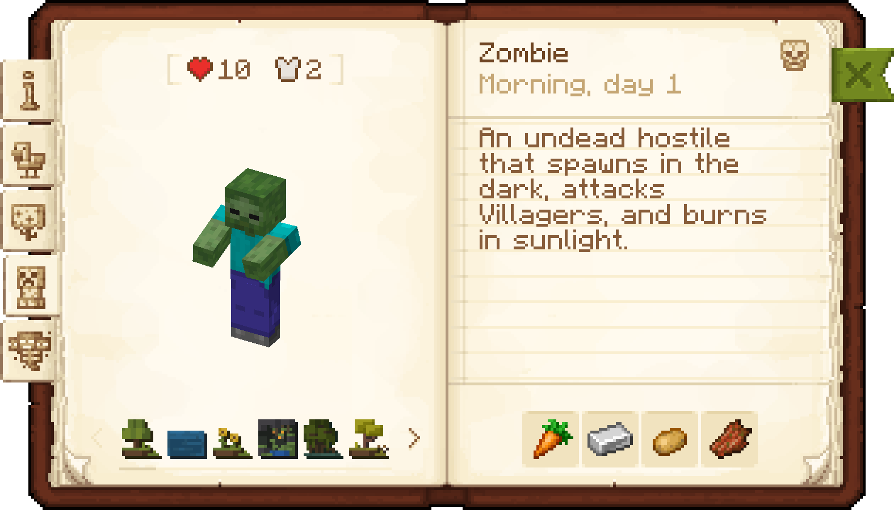
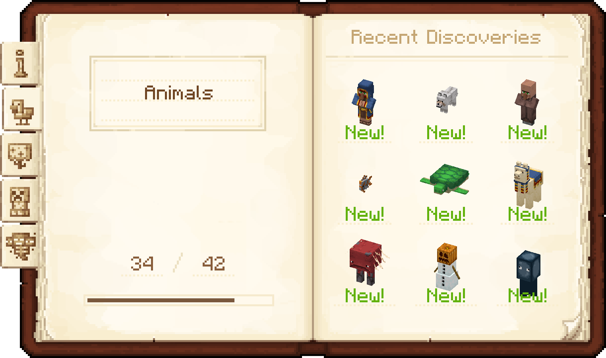

# Field Guide

Ever wondered what makes a Creeper tick? Or what that weird glowing block deep in the caves is? Grab your spyglass,
adventurer: it's time to start taking notes!

**Field Guide** is an exploration-focused mod that acts as the ultimate in-game encyclopedia. By looking at mobs and
plants through your trusty Spyglass, you can scan them to unlock entries in your own personal Field Guide.

---

## Features

* **Finally, Spyglasses have a use**! Aim and zoom in on mobs, critters, and fascinating blocks to
  analyze them from a distance.
* **Your own personal encyclopedia!** Every successful scan unlocks a brand-new page in your Field Guide. Build up your
  compendium as you travel!
* **Reward your curiosity!** Gives true explorers a reason to seek out every rare creature and biome. Gotta scan 'em
  all!

---

## Usage & Documentation

For full information, tutorials, and examples, please refer to the wiki:

**[Field Guide Wiki](https://moddedmc.wiki/en/project/field-guide/latest/docs/field-guide)**

---

## License

 

If you are thinking about using the code or assets from Field Guide, please note the mod's licensing. All assets of
Field Guide are all rights reserved by their respective creators, unless specified otherwise. The source code of
the mod is available under the MIT license.

---

## Credits

This mod was created as a collaboration between [evanbones](https://github.com/evanbones)
and [Kobber](https://github.com/Kobber). Assets were made by Kobber and evanbones, with additional contributions
from [Nekomaster](https://www.curseforge.com/members/nekomaster1000).

The book texture is modified from mortuusar's [Scholar](https://modrinth.com/mod/scholar), with permission, which also
works well when used alongside Field Guide!

---

 
